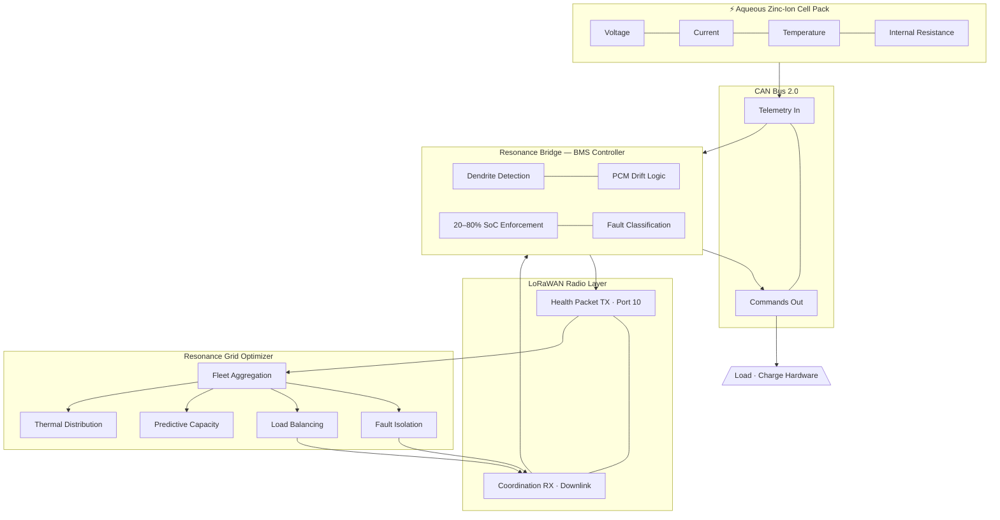

# Nexus-Block

**Cheap, safe, ultra-compact battery storage for off-grid use.**

An open-source Battery Management System bridge for Aqueous Zinc-Ion micro-energy storage, designed for modular deployment in off-grid environments.

---

## What This Is

A complete BMS software layer for managing modular 1kWh battery units ("Nexus-Blocks") that:

- **Monitor Zinc-Ion specific failure modes** — dendrite growth detection via internal resistance tracking
- **Enforce shallow-cycle buffering** — keeps cells between 20-80% SoC to double lifespan
- **Manage thermal boundaries** — software companion to passive Phase Change Material cooling
- **Broadcast health via LoRaWAN** — miles of range on near-zero power for mesh grid communication
- **Scale as a fleet** — stack blocks like Lego; the software handles the rest

## Why Zinc-Ion

No fire risk. No rare-earth metals. No lithium supply chain dependency. Water-based electrolyte means these can be stored indoors, underground, or anywhere. 5,000-10,000 cycle lifespan with 2025-2026 strain engineering advances.

See [docs/RESEARCH.md](docs/RESEARCH.md) for the full chemistry and architecture report.

## Quick Start

```bash
# Clone
git clone https://github.com/YOUR-USERNAME/nexus-block.git
cd nexus-block

# Run with stub hardware (no physical CAN/LoRa needed)
python src/resonance_bridge.py
```

This runs a simulated 3-block fleet and prints aggregated status. No dependencies beyond Python 3.10+.

## Integrating Real Hardware

The code uses abstract interfaces for CAN and LoRa. To connect real hardware:

1. **CAN Bus** — Subclass `CANInterface` in `resonance_bridge.py`. Use [python-can](https://python-can.readthedocs.io/) for socketcan/USB adapters.
2. **LoRaWAN** — Subclass `LoRaInterface`. Point it at your radio (RAK, Heltec, SX1280, etc.).
3. Instantiate `ResonanceBridge` or `NexusFleet` with your implementations.

## Project Structure

```
nexus-block/
├── src/
│   └── resonance_bridge.py   # BMS bridge, fleet manager, safety systems
├── docs/
│   └── RESEARCH.md            # Full research report (chemistry, hardware, strategy)
├── LICENSE                    # MIT — do whatever you want with this
└── README.md
```

## Architecture

```
┌─────────────┐    CAN Bus    ┌─────────────┐   LoRaWAN    ┌─────────┐
│ Battery Cell │◄────────────►│ Nexus-Block  │─────────────►│  RGO    │
│ (Zinc-Ion)   │              │ BMS Bridge   │              │ (Grid   │
└─────────────┘              │              │              │Optimizer)│
                              │ • Dendrite   │              └─────────┘
                              │   Monitor    │
                              │ • Thermal    │
                              │   Manager    │
                              │ • Cycle      │
                              │   Buffer     │
                              └─────────────┘
```

## Configuration

All tunable parameters are in the `NexusConfig` class:

| Parameter | Default | Purpose |
|-----------|---------|---------|
| `SOC_UPPER_LIMIT` | 80% | Max charge for shallow-cycle buffering |
| `SOC_LOWER_LIMIT` | 20% | Min charge before load disconnect |
| `DENDRITE_THRESHOLD` | 0.85 | Resistance drop ratio that triggers alert |
| `TEMP_OPTIMAL_HIGH` | 30°C | Upper bound of PCM sweet spot |
| `TEMP_OPTIMAL_LOW` | 20°C | Lower bound of PCM sweet spot |
| `HEALTH_CHECK_SECONDS` | 60 | Broadcast interval |

## What's Needed Next

This is the software foundation. To make it real:

- [ ] Bench test with a physical Zinc-Ion cell and CAN adapter
- [ ] Integrate a LoRa radio module (RAK4631 recommended)
- [ ] Build or source the Nexus-Block enclosure with PCM thermal layer
- [ ] Deploy RGO endpoint to receive and aggregate fleet health data
- [ ] Field test a 3-block stack in an actual off-grid environment

## Credits

Designed by **Samuel Jackson Grim** through multi-agent AI collaboration with Gemini and Claude. Chemistry research by Jennifer, systems architecture by Emily, strategic synthesis by Paul.

## License

MIT. Free to use, modify, deploy, sell, whatever. Just build something good with it.

---

flowchart LR
    subgraph Cell["Aqueous Zinc-Ion Cell Pack"]
        Z1[Voltage]
        Z2[Current]
        Z3[Temperature]
        Z4[Internal Resistance]
    end

---


